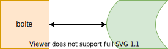

# Template - Fiche de synthèse

Ce document présente les consignes pour la rédaction de la fiche de synthèse (FS), à rendre avant le jour de l'examen écrit.

---
## Consignes

 - Votre FS doit être rédigée avec le format `Markdown` et suivre le modèle présenté ci-dessous. Elle ne doit pas dépasser l'équivalent d'une dizaine de pages.  
 - Le contenu de la FS doit être géré entre vous, avec l'aide d'un projet _GitHub_. Le projet sera hébergé sur le compte de l'un des membres du groupe, qui autorisera l'accès en écriture au projet à tous les autres membres du projet ainsi qu'à moi-même (mon pseudo _GitHub_ : _SDerrode_).
 - Le groupe doit se déclarer sur ce [fichier partagé](https://partage.liris.cnrs.fr/index.php/s/4Q3JB8Xk3RtfcR3), qui contient autant d'obglet qu'il y a de groupes. On y déposera le titre de la fiche, l'adresse URL du projet _GitHub_ et les noms et pseudo des étudiants. Utilisez le premier onglet vide disponible (si nécessaire, ajoutez des onglets).
 - Je récupérerai votre FS directement sur votre projet _GitHub_ le jour de l'examen. Le jour de l'examen constitue donc la date butoir pour terminer votre FS.

*Remarque* Le système de gestion de versions **git** est présenté en cours. Vous trouverez le scenario du tuto joué durant le second cours dans le répertoire [tuto-git-gitlab](./tuto-git-gitlab) de ce projet _GitHub_.

---
## Markdown

 - `Markdown` est un simple format texte dans lequel on ajoute des balises, pour mettre en gras, inclure des images, faire des liens hypertextes... Ces balises peuvent être interprétées par différents moteurs pour obtenir un rendu en _html_, en _pdf_, en _rtf_ ou en _word_... Pour apprendre les quelques balises nécessaires à une mise en page minimaliste (mais suffisante la plupart du temps), vous trouverez de nombreux tutoriaux sur internet, dont celui-ci : [Markdown - Wikipédia](https://fr.wikipedia.org/wiki/Markdown).

 - La totalité des éditeurs de textes généralistes, tels _Sublime Text_, _Geany_..., gèrent très bien ce format, et incluent des convertisseurs automatiques. Remarquez d'ailleurs que _GitHub_ interprètent automatiquement les fichiers `Markdown` que vous déposez sur leur site.

 - Voici cependant quelques outils _open source_ spécifiques qui pourraient vous aider pour débuter:    
    - [ghostwriter](https://wereturtle.github.io/ghostwriter/) : _Linux_ et _Windows_
    - [abricotine](http://abricotine.brrd.fr) : _Linux_, _Windows_ et _Mac OS X_ (en version beta)
    - [remarkable](https://remarkableapp.github.io) : _Windows_ et _Linux_

Il existe des éditeurs en ligne, dont [Dilinger](https://dillinger.io), [StackEdit](https://stackedit.io/app#) (ce dernier requiert une inscription).

---
## Organisation de la FS

La FS sera composée de plusieurs fichiers `Markdown`. Le fichier principal de votre FS sera appelé _README.md_, et inclura des liens vers les différents fichiers qui composent votre fiche. 

Votre fichier _README.md_ sera organisé de la manière suivante :

 - le titre de votre FS, les noms des auteurs, l'année (les informations classiques d'une page de garde).    
 - un résumé d'une dizaine de lignes.    
 - le sommaire de votre document.     
 - des liens vers des fichiers `Markdown` qui développent votre sujet d'étude (Introduction, chapitre 1, chapitre 2, ..., Conclusion).    
 - un lien vers un fichier `Markdown` qui contiendra la bibliographie et la webographie.    
 - des liens vers des fichiers `Markdown` qui présentent d'éventuelles annexes.

---
## Ajouts d'images, de schémas ou de diagrammes

Si vous souhaitez intégrer des diagrammes ou des schéma (ou tout autre diagramme vectoriel), je vous conseille l'utilisation de [diagram.net](https://app.diagrams.net) (open source). 

Vous pouvez sauvegarder vos graphiques _diagram.net_ sur votre machine (cf exemple dans le dossier _figures_, à côté de ce fichier) et les convertir dans des images aux formats _png_, _svg_... pour les intégrer ensuite dans `Markdown` selon l'exemple suivant :

    la commande 

 donne

    la commande  

 donne

