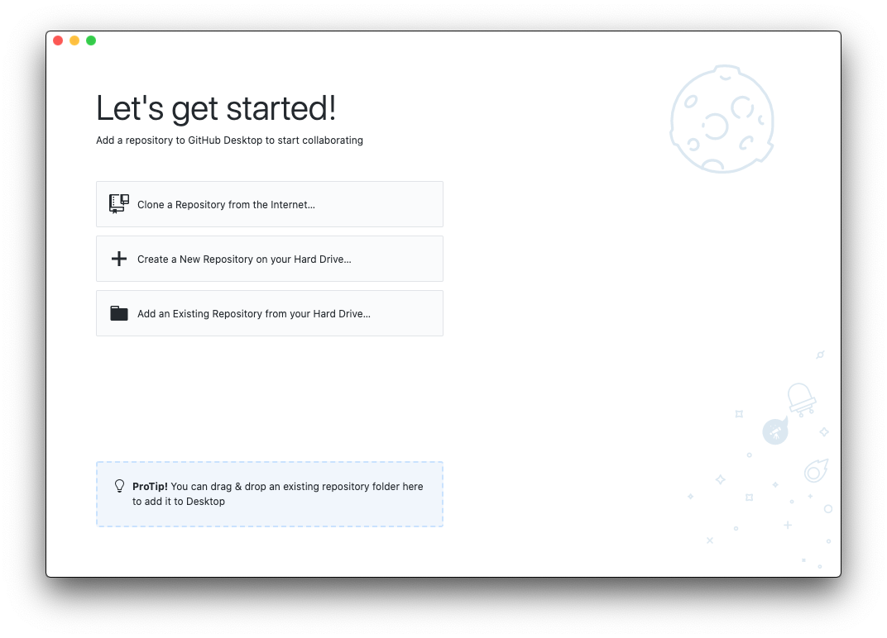
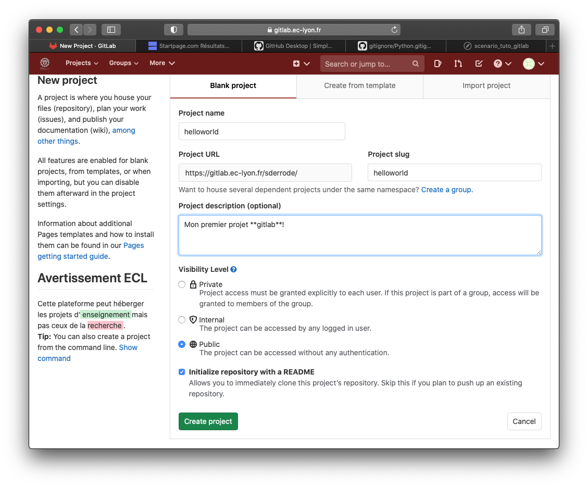
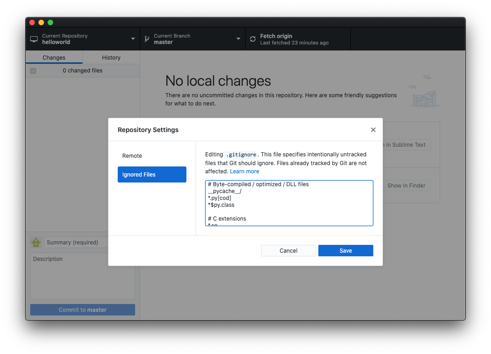
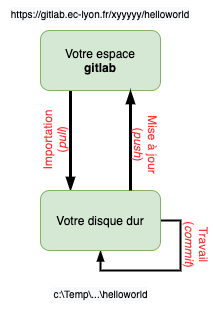

## Tuto sur git/gitlab

Ce document présente un tuto à l'usage de **git**/**gitlab**. Il est consultable sous forme de vidéo sur le Moodle du cours, à l'adresse https://pedagogie1.ec-lyon.fr/course/view.php?id=969.

Comme tout tutoriel, ce document a besoin de vos retours pour s'améliorer! N’hésitez pas à m'envoyez un mail décrivant vos difficultés et, éventuellement, les solutions que vous auriez trouvées pour les contourner.

---
### Installer **git** et *Github Desktop*

**git** est disponible par défaut sur les machines *Mac OS X* et *Linux*. S'il est absent de *Windows* (pour le savoir, lancez la commande *git* dans un Terminal/Invite de commandes), alors installez-le à partir de ce lien : [git-scm](https://git-scm.com/download/win). Lors de l'installation, validez les choix par défaut qui vous sont proposés.

L'interface *Github Desktop* que nous allons installer n'est absolument pas nécessaire pour travailler avec git. Mais elle évite, dans un premier temps, d'utiliser des commandes manuelles à partir d'un Terminal.

 1. Téléchargez, installez et lancez l'application [Github Desktop](https://desktop.github.com/).
 
 

 1. Configurer *Github Desktop* (cette étape n'est nécessaire que si vous ne l'avez pas déjà fait lors de l'installation du logiciel) : aller dans le menu ``Préférences / git``    
    - entrez votre nom et votre adresse émail.

---
### Gérer son premier projet git avec gitlab

 1. Montrer l'interface de **gitlab**    
    - Adresse: https://gitlab.ec-lyon.fr;    
    - Identifiant: ceux de Centrale;     
    - Naviguer dans le projet INF-TC2 (que les étudiants ont déjà étudié). Donner quelques explications sur l'interface.
 1. Créer un nouveau projet    
    - Nom : HelloWorld;     
    - Description: Mon premier projet gitlab;    
    - Discuter *Public/Internal/Private*;   
    - Sélectionner *Initialize repository with a README*;
     
    - Cliquer sur l'icône ``Clone`` et copiez le lien ``Clone with HTTPS``, qui ressemble à https://gitlab.ec-lyon.fr/xyyyyy/helloworld.git. 
 1. Basculer sur *Github Desktop*,     
    - Sélectionner l'option ``Clone a Repository from the Internet``, puis l'onglet ``URL`` (ou menu ``File``, ``Clone repository``).
    - Copier l'adresse précédemment mise en mémoire dans l'espace dédié, et choisir dans ``local path`` le répertoire dans lequel votre projet sera copié. Appuyez sur le bouton ``Clone`` de l'interface pour lancer l'importation de votre projet **gitlab** sur votre machine.
    - Vérifier dans un gestionnaire de fichiers que le *repo* est bien copié localement sur sa machine et qu'il contient un répertoire caché (``.git``) et le fichier *readme.md*.   
    - Basculer sur l'onglet ``history``     
 1. Pour éviter que certains fichiers temporaires ne soient suivis par **git**, on va spécifier les fichiers a exclure dans un fichier appelé *.gitignore* (il s'agit d'un fichier caché). Pour cela    
    - Aller dans le menu ``Repository``, sous-menu ``Repository settings``, puis ``Ignored Files``.   
    - Copier le contenu du fichier qui se trouve à l'adresse https://github.com/github/gitignore/blob/master/Python.gitignore dans l'espace réservé, puis ``Save``.      
          
    - On doit alors *Commiter* les changements (le texte par défaut qui décrit le ``commit`` est OK). Plus de détails sur ces ``commit`` plus loin.      
 1. Éditer le fichier *readme.md* avec *Sublime Text* et enregistrer les changements localement:
    - Basculer vers *Github Desktop* et discuter les changements qui interviennent sur l'interface.    
    - *Commiter* les changements, et monter l'onglet *History*.    
    - *Pusher* le travail vers gitlab en utilisant l'option *Publish Branch*.
    - Basculer vers **gitlab** et vérifier que les changements ont bien étaient publiés   
 1. Basculer vers *Spyder* pour éditer du code python:   
    - Taper un programme *incremente_de_un(x)* et sauvegarder dans votre répertoire local sous le nom de fichier *incremente.py*. 
    - *commiter* les changements dans *Github Desktop*   
    - Refaire la même chose avec un autre fichier (*incremente_de_deux(x)*), à sauvegarder dans un sous répertoire *test*.
    - *Pusher* son travail vers **gitlab**, et vérifier que tout se met bien à jour.

De manière synthétique, une fois le projet créé,

   1. vous modifiez vos code sources, et enregistrez régulièrement vos changements avec un ``commit`` (donc en local). Vous pouvez ``commiter`` des sources même s'ils ne sont pas terminés ou comportent des bugs. À ce stade cela n'a pas d'importance.     
   2. quand vous êtes content de votre travail, et que vos jugez vos algorithmes fonctionnels, vous publiez vos précédents ``commit`` sur **gitlab** avec un ``push``.

Ce comportement est illustré par le schéma de la figure suivante:

      

-----
Pour détruire ce projet (sans grand interêt), il faut :

 1. Quitter Spyder pour farmer les fichiers en cours.
 1. Détruire la version locale en utilisant *Github Desktop*: sélectionner l'onglet ``Current Repository``, et le menu contextuel sur le nom de votre projet permet d'accéder à ``Remove``. Penser à cocher la suppression physique des fichiers si vous le souhaiter (sinon seul la gestion du projet par *Github Desktop* sera supprimée, les fichiers seront toujorus présents sur votre disque dur).
 1. Détruire la version distante sur **gitlab**: Dans la barre de menu latérale à gauche de l'interface Web, sélectionnez l'icône représentant une roue crantée correspondant à ``Settings``. Dans le sous-menu ``Général``, appuyez sur le bouton ``Expand`` correspondant à la ligne : *Advanced*. Tout en bas, sélectionner ``Delete Project``, copier la phrase demandée et appuyer sur le bouton pour confirmer.

-----
A quoi ça sert d'utiliser **git** et **gitlab** ? Les avantages sont nombreux:

 - Avoir un copie de son travail sur un serveur distant.
 - Sauvegarde incrémentale et dun historique des modification (undo infini!)
 - Partager son travail avec tout le monde (si votre projet est publique), ou avec des personnes choisies (invitations personnelles).
 - Travailler à plusieurs sur le même projet et en même temps (mais ça, c'est un autre tuto...)   
      - fusion automatique (ou presque) des sources
      - traçage des modification (qui, qoui)

**Stéphane Derrode**